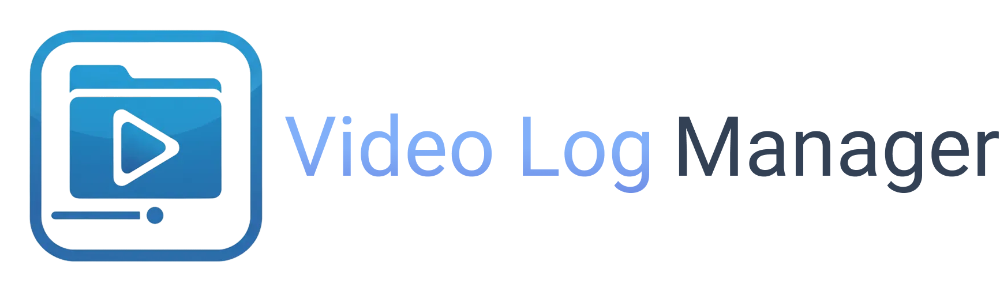
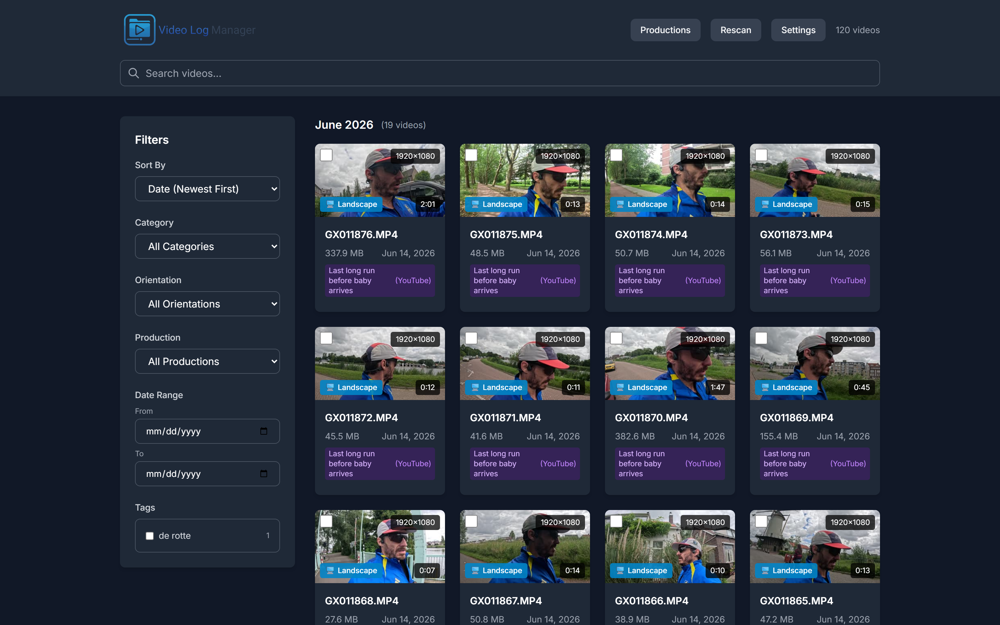
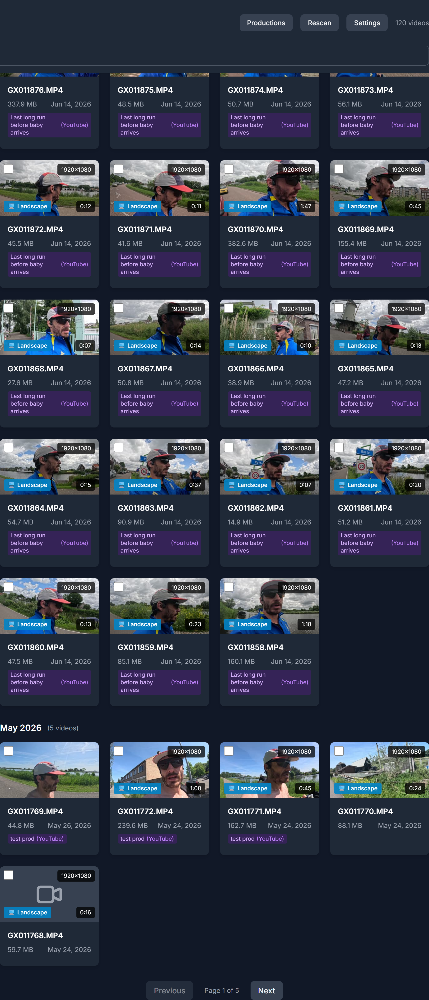
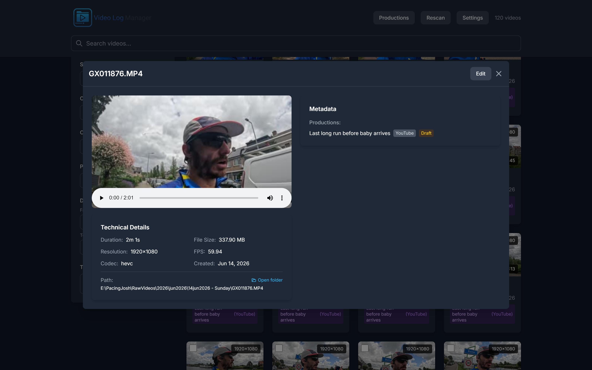
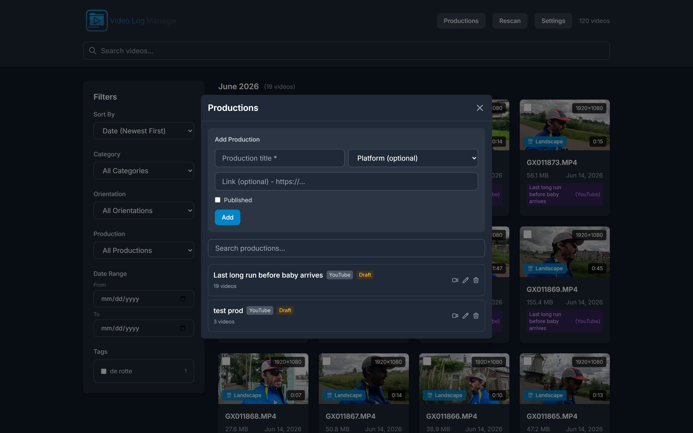
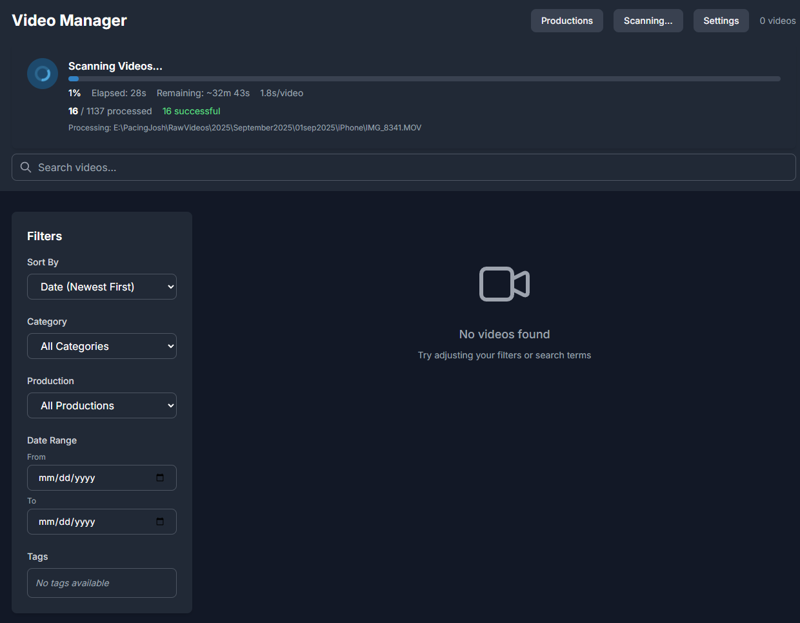
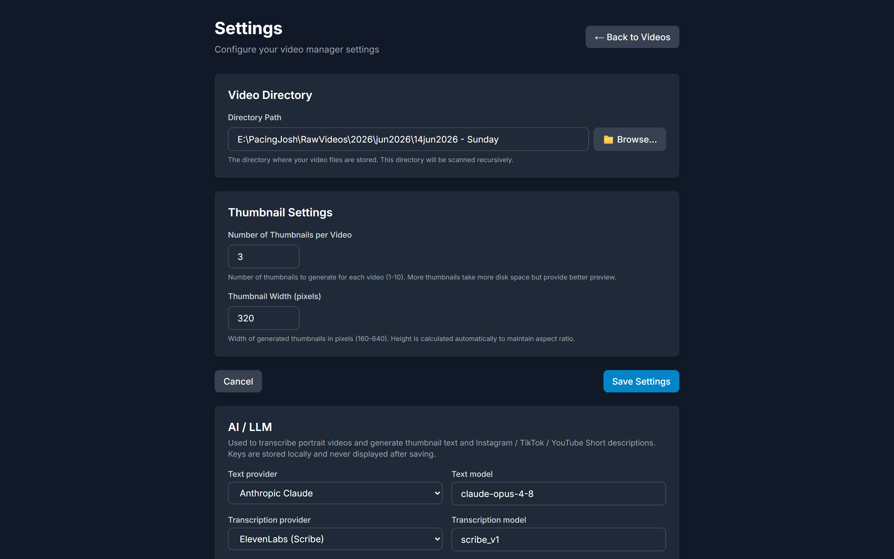

<div align="center">



A modern, full-stack video indexing and management application for organizing and browsing large video collections. Built for runners, content creators, and anyone managing thousands of videos locally.

Created to help manage my own videos for my Youtube Channel [Pacing Josh](https://www.youtube.com/@pacingjosh)


</div>



## Features

### Video Management
- **Recursive Directory Scanning** - Automatically index videos from any directory structure
- **Thumbnail Generation** - Auto-generate multiple thumbnails per video for quick preview
- **Video Streaming** - Built-in video player with seeking support
- **Metadata Extraction** - Extract duration, resolution, FPS, codec, and more using FFmpeg

### Organization & Search
- **Full-Text Search** - Search across filenames, locations, and notes
- **Tagging System** - Multi-tag support with tag management
- **Categories** - Organize videos into categories
- **Date Filtering** - Filter by date range
- **Notes** - Add detailed notes to each video

### Productions
- **Production Tracking** - Create and manage productions (YouTube, TikTok, Instagram, etc.)
- **Many-to-Many Linking** - Link any video to multiple productions and vice versa
- **Platform & Status** - Track platform, publish link, and draft/published status per production
- **Production Filtering** - Filter the video grid by production to see which clips belong where

### Advanced Features
- **Metadata Editing** - Edit all metadata inline
- **Bulk Operations** - Update categories, tags, and production assignments across multiple videos at once
- **Real-Time Progress** - Live scanning progress with ETA and per-file status
- **Dark Mode** - Clean, responsive interface with dark mode
- **SQLite Database** - Fast, reliable local storage
- **Auto-Setup** - Data directories are created automatically on first run

## Architecture

**Backend:**
- Actix-web (Rust) - REST API
- SQLite - Database
- Diesel - ORM
- FFmpeg - Video processing

**Frontend:**
- Next.js 14 (App Router)
- React 18
- TypeScript
- Tailwind CSS

> **Note:** The original Python/FastAPI backend (`backend/`) is **deprecated and no longer maintained**. All active development is on the Rust backend (`backend-rust/`).

## Prerequisites

### Required Software

| Software | Minimum Version | Installation |
|----------|----------------|--------------|
| Rust | 1.75+ | [rustup.rs](https://rustup.rs/) |
| Node.js | 18.0+ | [nodejs.org](https://nodejs.org/) |
| FFmpeg | Latest | See OS-specific instructions below |

### Installing FFmpeg

<details>
<summary><b>macOS</b></summary>

```bash
# Using Homebrew
brew install ffmpeg

# Verify installation
ffmpeg -version
```
</details>

<details>
<summary><b>Ubuntu/Debian Linux</b></summary>

```bash
# Install FFmpeg
sudo apt update
sudo apt install ffmpeg

# Verify installation
ffmpeg -version
```
</details>

<details>
<summary><b>Windows</b></summary>

1. Download FFmpeg from [ffmpeg.org](https://ffmpeg.org/download.html#build-windows)
2. Extract to `C:\ffmpeg`
3. Add `C:\ffmpeg\bin` to your system PATH
4. Open a new Command Prompt and verify:
```cmd
ffmpeg -version
```
</details>

### System Requirements

- **OS**: macOS 10.15+, Ubuntu 20.04+, Windows 10+
- **RAM**: 2GB minimum (4GB+ recommended)
- **Disk Space**:
  - Application: ~10MB (Rust binary)
  - Database: ~1-2MB per 1000 videos
  - Thumbnails: ~50-100KB per video

## Quick Start

### 1. Clone the repository

```bash
git clone https://github.com/joaoh82/pacingjosh-video-manager.git
cd pacingjosh-video-manager
```

### 2. Backend setup

```bash
cd backend-rust

# Install Diesel CLI (first time only)
cargo install diesel_cli --no-default-features --features sqlite

# Configure environment
cp .env.example .env
# Edit .env to set VIDEO_DIRECTORY and other settings

# Run database migrations
diesel migration run

# Start the server
cargo run
```

The API will be available at `http://localhost:8000`.

### 3. Frontend setup

```bash
cd frontend
npm install
npm run dev
```

### 4. First-Time Setup

1. Open **http://localhost:3000** in your browser
2. You'll be redirected to the setup page
3. Click **"Browse..."** to select your video directory (or type the path)
4. Click **"Start Scanning"**
5. Wait for the scan to complete
6. Start browsing your videos!

## Usage

### Scanning Videos

**Initial Scan:**
- Navigate to http://localhost:3000
- Enter your video directory path
- The application will recursively scan all subdirectories
- Supported formats: .mp4, .mov, .avi, .mkv, .webm, .flv, .wmv

**Rescanning:**
- Click the **"Rescan"** button in the header to pick up new or changed files
- Progress is shown in real time with ETA

### Searching and Filtering

**Search:**
- Use the search bar to find videos by filename, location, or notes

**Filters:**
- **Category** - Filter by video category
- **Production** - Filter by production to see which clips belong to a specific project
- **Tags** - Select multiple tags
- **Date Range** - Filter by creation date
- **Sort** - Multiple sorting options (date, name, size, duration)

### Managing Productions

1. Click **"Productions"** in the header to open the production manager
2. Create a production with a title, platform (YouTube, TikTok, etc.), and optional link
3. Mark productions as published or draft
4. Link videos to productions from the video detail modal or via bulk edit

### Editing Metadata

**Single Video:**
1. Click on any video card
2. Click **"Edit"** in the modal
3. Update category, location, tags, notes, or linked productions
4. Click **"Save"**

**Bulk Edit:**
1. Select multiple videos using the checkboxes
2. Click **"Bulk Edit"** in the bottom toolbar
3. Set category, add/remove tags, add/remove production assignments
4. Click **"Apply Changes"**

### Watching Videos

- Click any video card to open the modal
- Use the built-in HTML5 video player
- Seeking and playback controls included
- Videos stream directly from your local files

## Screenshots

### Main Screen

*Browse your video collection with thumbnails, tags, and production badges*

### Video Grid

*Video cards show duration, resolution, file size, tags, and linked productions*

### Video Player Modal

*Watch videos and edit metadata in a sleek modal interface*

### Production Manager

*Create and manage productions with platform, link, and publish status*

### Scanning Progress

*Real-time scanning progress with ETA and per-file status*

### Settings Page

*Configure video directory and thumbnail preferences*

## Configuration

### Backend Configuration

Edit `backend-rust/.env`:

```bash
HOST=127.0.0.1
PORT=8000
DATABASE_PATH=./data/database.db
VIDEO_DIRECTORY=/path/to/videos
THUMBNAIL_DIRECTORY=./data/thumbnails
THUMBNAIL_COUNT=5
THUMBNAIL_WIDTH=320
```

### Frontend Configuration

Edit `frontend/.env.local`:

```bash
NEXT_PUBLIC_API_URL=http://localhost:8000/api
```

## API Documentation

### Key Endpoints

```
POST   /api/scan                    - Start directory scan
GET    /api/scan/status/{id}        - Get scan progress
POST   /api/scan/rescan             - Rescan existing library
GET    /api/videos                  - List/search videos
GET    /api/videos/{id}             - Get video details
PUT    /api/videos/{id}             - Update video metadata
DELETE /api/videos/{id}             - Delete video record
POST   /api/videos/bulk-update      - Bulk update videos
GET    /api/tags                    - List all tags
GET    /api/productions             - List all productions
POST   /api/productions             - Create production
PUT    /api/productions/{id}        - Update production
DELETE /api/productions/{id}        - Delete production
GET    /api/stream/{id}             - Stream video
GET    /api/thumbnails/{id}/{index} - Get thumbnail
GET    /api/config                  - Get configuration
PUT    /api/config                  - Update configuration
```

## Database Schema

### Tables

**videos**
- id, file_path, filename, file_hash
- duration, file_size, resolution, fps, codec
- created_date, indexed_date, thumbnail_count

**metadata**
- id, video_id, category, location, notes

**tags**
- id, name

**video_tags**
- video_id, tag_id (junction table)

**productions**
- id, title, platform, link, is_published

**video_productions**
- video_id, production_id (junction table)

## Development

### Project Structure

```
pacingjosh-video-manager/
├── backend-rust/               # Active Rust backend (Actix-web + Diesel)
│   ├── src/
│   │   ├── models/             # Diesel ORM models
│   │   ├── routes/             # API route handlers
│   │   ├── services/           # Business logic
│   │   ├── config.rs
│   │   ├── db.rs
│   │   ├── schema.rs
│   │   └── main.rs
│   ├── migrations/             # Diesel migrations
│   └── data/                   # Runtime data (gitignored)
├── frontend/                   # Next.js 14 frontend
│   └── src/
│       ├── app/                # Next.js pages
│       ├── components/         # React components
│       ├── lib/                # API client & types
│       └── styles/             # Global styles
├── backend/                    # [DEPRECATED] Python/FastAPI backend
└── images/                     # Screenshots & branding
```

## Troubleshooting

### FFmpeg Not Found
**Error:** `FFmpeg is not installed or not in PATH`

**Solution:**
- Install FFmpeg (see Prerequisites)
- Verify installation: `ffmpeg -version`
- Add FFmpeg to your PATH

### Port Already in Use
**Error:** `Address already in use`

**Solution:**
```bash
# Find and kill process
lsof -ti:8000 | xargs kill  # Backend
lsof -ti:3000 | xargs kill  # Frontend

# Or use different ports
# Backend: set PORT=8001 in .env
# Frontend: npm run dev -- -p 3001
```

### Database Locked
**Error:** `database is locked`

**Solution:**
- Close any SQLite browser tools
- Restart the backend server
- Check file permissions on `data/database.db`

### Videos Not Showing
**Issue:** Scan completed but no videos appear

**Solution:**
1. Check if videos are in supported formats
2. Verify file permissions
3. Check backend logs for errors
4. Try rescanning via the Rescan button

### Thumbnails Not Loading
**Issue:** Video cards show placeholder icon

**Solution:**
1. The `data/thumbnails/` directory is created automatically on startup
2. Verify FFmpeg can read your video files
3. Check browser console for 404 errors
4. Rescan to regenerate thumbnails

## Roadmap

Future enhancements planned:

- [ ] Video analytics and statistics dashboard
- [ ] Export/import functionality
- [ ] Mobile app companion
- [ ] Cloud storage integration
- [ ] Advanced AI features (face detection, transcription)
- [ ] Collaborative features and sharing

## Contributing

Contributions, issues, and feature requests are welcome!

1. Fork the repository
2. Create your feature branch (`git checkout -b feature/AmazingFeature`)
3. Commit your changes (`git commit -m 'Add some AmazingFeature'`)
4. Push to the branch (`git push origin feature/AmazingFeature`)
5. Open a Pull Request

## License

This project is licensed under the MIT License - see the [LICENSE](LICENSE) file for details.

## Acknowledgments

- Built with [Actix-web](https://actix.rs/)
- Database ORM by [Diesel](https://diesel.rs/)
- Powered by [FFmpeg](https://ffmpeg.org/)
- UI framework by [Next.js](https://nextjs.org/)
- Styled with [Tailwind CSS](https://tailwindcss.com/)

## Contact

**Joao Henrique Machado Silva** - [@joaoh82](https://github.com/joaoh82)

Project Link: [https://github.com/joaoh82/pacingjosh-video-manager](https://github.com/joaoh82/pacingjosh-video-manager)

---

<div align="center">

**Made for runners who love tracking their journey**

*If you find this project helpful, please consider giving it a star!*

</div>
