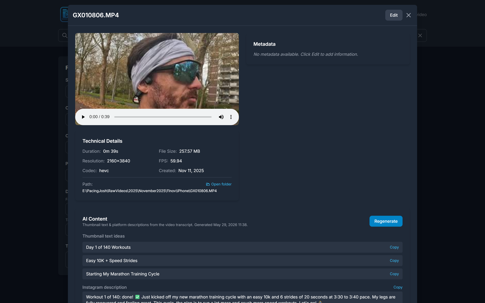
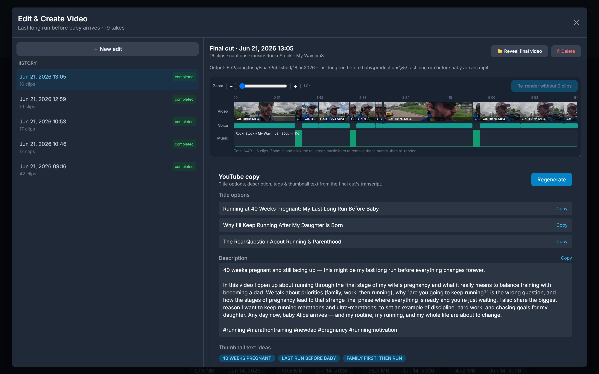

<p align="center">
  
</p>

<p align="center">
  <b>Index. Search. Edit your video library — with AI.</b><br/>
  A local-first desktop app for indexing, searching, tagging, and AI-editing large video collections.<br/>
  Built for runners, content creators, and anyone managing thousands of videos locally.
</p>

<p align="center">
  <a href="https://github.com/joaoh82/pacingjosh-video-manager/actions/workflows/ci.yml"></a>
  <a href="https://github.com/joaoh82/pacingjosh-video-manager/releases/latest"></a>
  
  
  
  
  
  
</p>

<p align="center">
  <a href="images/demo.mp4">
    
  </a>
  <br/>
  <sub><i>▶ Click the GIF to watch the full-quality MP4 walkthrough</i></sub>
</p>

<p align="center">
  <i>Created to help manage my own videos for my YouTube channel <a href="https://www.youtube.com/@pacingjosh">Pacing Josh</a></i>
</p>

## ⬇️ Download & Install

Pre-built installers for every release are published on the **[Releases page →](https://github.com/joaoh82/pacingjosh-video-manager/releases/latest)**. FFmpeg is bundled inside the app — end users don't need to install anything else.

| OS | Download | Install |
| --- | --- | --- |
| **Windows** | `...x64-setup.exe` (NSIS) or `...x64_en-US.msi` | Run the installer. Builds are unsigned, so SmartScreen may warn — click **More info → Run anyway**. |
| **macOS** (Apple Silicon) | `...aarch64.dmg` | Open the DMG and drag **Video Manager** to Applications. Unsigned, so on first launch **right-click → Open** — or run `xattr -dr com.apple.quarantine "/Applications/Video Manager.app"`. |
| **Linux** | `...amd64.AppImage` or `...amd64.deb` | **AppImage:** `chmod +x ./*.AppImage && ./*.AppImage`. **Deb:** `sudo apt install ./<file>.deb`. |

> macOS builds currently target **Apple Silicon (M-series)**; they run on Intel Macs via Rosetta 2. See [Releases & CI](#releases--ci) to add a native Intel/universal build.
>
> Installers are **unsigned** (no code-signing certificates are configured), so the OS shows the usual "unverified developer" prompts. [Releases & CI](#releases--ci) explains how to enable signing.

## Features

### Video Management

- **Recursive Directory Scanning** - Automatically index videos from any directory structure
- **Thumbnail Generation** - Auto-generate multiple thumbnails per video for quick preview
- **Video Streaming** - Built-in video player with seeking support
- **Metadata Extraction** - Extract duration, resolution, FPS, codec, and more using FFmpeg

### Organization & Search

- **Full-Text Search** - Search across filenames, locations, and notes
- **Tagging System** - Multi-tag support with tag management
- **Categories** - Organize videos into categories
- **Date Filtering** - Filter by date range
- **Notes** - Add detailed notes to each video

### Productions

- **Production Tracking** - Create and manage productions (YouTube, TikTok, Instagram, etc.)
- **Many-to-Many Linking** - Link any video to multiple productions and vice versa
- **Platform & Status** - Track platform, publish link, and draft/published status per production
- **Production Filtering** - Filter the video grid by production to see which clips belong where

### AI & Automated Editing (desktop)

- **Transcription** - Transcribe videos via ElevenLabs (Scribe), OpenAI (Whisper), or Google Gemini
- **Social Copy Generation** - Generate thumbnail text and Instagram / TikTok / YouTube Short titles, descriptions, tags, and hashtags from a portrait video's transcript
- **Edit & Create Video Pipeline** - Add raw takes to a production, paste your script, and the app transcribes every take (with word-level timestamps), asks an LLM to assemble the best cut (newest clean takes, re-shoots in timeline order, warm-up "Hey …" intros trimmed), writes an **edit decision list** as JSON, then stitches the final clip with FFmpeg — all tracked with live progress
- **Burned-in Captions** - Optionally burn the spoken words onto the final video, re-timed per clip from the transcript
- **Tighten the Cut** - Optionally remove long silences and filler ("um"/"uh") inside clips, splitting each into speech-only sub-clips (jump cuts) for a tighter result
- **Enhance Voice** - CapCut-style noise removal: rolls off wind/handling rumble, knocks down steady background hiss, strips mouth clicks/pops, and adds a gentle clarity boost so the cleaned voice doesn't sound muffled. A single **intensity** slider (0–100%) controls how aggressive the cleanup is. Pick takes two ways: **before** rendering, check them in the take list (each take has a thumbnail + click-to-**preview** so you can see/hear what it is first); or **after** rendering, click a clip on the interactive timeline and re-render with it enhanced. Runs entirely through bundled FFmpeg filters — no extra API keys
- **Background Music** - Optionally pick a music track that loops under the speech, with two configurable levels: a volume for when no one is talking and a lower volume for while you're talking. Ducking is driven by the transcript's word timestamps (not audio detection), so it works regardless of how quietly the speech was recorded — and a talking volume of 0% truly silences the music while you speak
- **Choose Output Location** - Pick the output folder; each run is written to a numbered version subfolder (`productions/v1`, `productions/v2`, …) so re-edits never overwrite each other. The folder you pick stays fixed (no nested production-name folders, nothing in the app's data directory)
- **YouTube Copy** - One click on a finished run generates 3 SEO-optimized title options, a YouTube description, keyword tags, and thumbnail-text ideas — built from the final cut's transcript and saved with the run
- **Thumbnail Builder** - Grab a real still frame from the final video (scrub the slider and the preview updates live) and lay stylized text on top in an in-app canvas editor (font size, color, outline, position, CAPS; thumbnail-text suggestions one click away). Export a 1280×720 PNG or save it next to the video. Optional **✨ AI restyle** sends the frame to your chosen image model for a more produced look while the text stays a real overlay. The image **provider & model are configurable** in Settings (Google Gemini or OpenAI GPT Image — e.g. `gpt-image-2`, `gemini-2.5-flash-image`); requires the matching API key
- **Interactive Timeline** - Each finished run shows an editor-style timeline (like CapCut) with an in-app **preview player**: play the rendered video and a red playhead tracks across the timeline; click or drag the ruler to scrub and the video jumps to that point — handy for spotting which clips still need work. Below it, a video track with clip thumbnails, a voice track showing where speech is, and a music track whose bar height drops to the ducked level under speech. Zoom/scroll in, **click a video clip to mark it for voice enhancement** (🎙 marks clips already enhanced), click the music "bursts" you don't want to remove them, then re-render a new version — reusing the saved cut and transcription (no extra transcription cost)
- **Edit History** - Every run is saved per production; reopen the modal to browse past runs, view their script, edit decision list, timeline, and activity log, reveal the final video, or delete a run (removing its database entry and its files from disk)
- **Editable Prompts** - Both the copy-generation prompt and the edit-planning prompt are editable in Settings
- **Local Keys** - API keys are stored locally in `config.json` and never returned by the API after saving

### Advanced Features

- **Metadata Editing** - Edit all metadata inline
- **Bulk Operations** - Update categories, tags, and production assignments across multiple videos at once
- **Real-Time Progress** - Live scanning progress with ETA and per-file status
- **Dark Mode** - Clean, responsive interface with dark mode
- **SQLite Database** - Fast, reliable local storage
- **Auto-Setup** - Data directories are created automatically on first run

## Architecture

**Desktop shell:**

- [Tauri 2.0](https://v2.tauri.app/) (`src-tauri/`) — ships the app as a single native installer per OS. Embeds the Rust backend on a dedicated thread and loads the static-exported frontend inside a WebView.

**Backend:**

- Actix-web (Rust) — REST API, compiled as both a standalone binary and a library (embedded into Tauri)
- SQLite — Database
- Diesel — ORM
- FFmpeg — Video processing (bundled as a Tauri sidecar in release builds)

**Frontend:**

- Next.js 14 (App Router, fully client-side, static-exported)
- React 18
- TypeScript
- Tailwind CSS

> **Note:** The original Python/FastAPI backend (`backend/`) is **deprecated and no longer maintained**. All active development is on the Rust backend (`backend-rust/`).

## Prerequisites

### Required Software


| Software | Minimum Version | Installation                       |
| -------- | --------------- | ---------------------------------- |
| Rust     | 1.75+           | [rustup.rs](https://rustup.rs/)    |
| Node.js  | 18.0+           | [nodejs.org](https://nodejs.org/)  |
| FFmpeg   | Latest          | See OS-specific instructions below |


### Installing FFmpeg

**macOS**

```bash
# Using Homebrew
brew install ffmpeg

# Verify installation
ffmpeg -version
```


**Ubuntu/Debian Linux**

```bash
# Install FFmpeg
sudo apt update
sudo apt install ffmpeg

# Verify installation
ffmpeg -version
```


**Windows**

1. Download FFmpeg from [ffmpeg.org](https://ffmpeg.org/download.html#build-windows)
2. Extract to `C:\ffmpeg`
3. Add `C:\ffmpeg\bin` to your system PATH
4. Open a new Command Prompt and verify:

```cmd
ffmpeg -version
```


### System Requirements

- **OS**: macOS 10.15+, Ubuntu 20.04+, Windows 10+
- **RAM**: 2GB minimum (4GB+ recommended)
- **Disk Space**:
  - Application: ~10MB (Rust binary)
  - Database: ~1-2MB per 1000 videos
  - Thumbnails: ~50-100KB per video

## Quick Start (Desktop App — Recommended)

The app is built and distributed as a Tauri 2.0 desktop bundle. Users who just
want to run the app can grab the latest installer from the
[releases page](https://github.com/joaoh82/pacingjosh-video-manager/releases)
and skip everything below.

For development builds:

```bash
git clone https://github.com/joaoh82/pacingjosh-video-manager.git
cd pacingjosh-video-manager

# First-time setup
cargo install tauri-cli --version "^2.0"
bash scripts/fetch-ffmpeg.sh        # or scripts\fetch-ffmpeg.ps1 on Windows
cargo tauri icon images/icon.png    # generate app icons (square 512x512 source)

# Run in dev mode (launches Next.js + Tauri window)
cargo tauri dev                     # run from repo root; finds src-tauri/ automatically

# Build a platform installer (msi/dmg/deb/appimage)
cargo tauri build
```

The Tauri shell embeds the Rust backend (via `video_manager_backend::run_blocking`)
on a dedicated OS thread, picks a free localhost port at startup, and serves
the static-exported Next.js frontend from an embedded WebView. Per-user app
data lives at `%APPDATA%\com.pacingjosh.video-manager\` (Windows),
`~/Library/Application Support/com.pacingjosh.video-manager/` (macOS), or
`~/.local/share/com.pacingjosh.video-manager/` (Linux). See
[**docs/data-storage.md**](docs/data-storage.md) for exactly what's stored there
(database, thumbnails, config + API keys) and what isn't.

## Quick Start (Web Dev Workflow)

Prefer this when iterating on frontend or backend code independently.

### 1. Clone the repository

```bash
git clone https://github.com/joaoh82/pacingjosh-video-manager.git
cd pacingjosh-video-manager
```

### 2. Backend setup

```bash
cd backend-rust

# Install Diesel CLI (first time only)
cargo install diesel_cli --no-default-features --features sqlite

# Configure environment
cp .env.example .env
# Edit .env to set VIDEO_DIRECTORY and other settings

# Run database migrations
diesel migration run

# Start the server
cargo run
```

The API will be available at `http://localhost:8000`.

### 3. Frontend setup

```bash
cd frontend
npm install
npm run dev
```

### 4. First-Time Setup

1. Open **[http://localhost:3000](http://localhost:3000)** in your browser
2. You'll be redirected to the setup page
3. Click **"Browse..."** to select your video directory (or type the path)
4. Click **"Start Scanning"**
5. Wait for the scan to complete
6. Start browsing your videos!

## Usage

### Scanning Videos

**Initial Scan:**

- Navigate to [http://localhost:3000](http://localhost:3000)
- Enter your video directory path
- The application will recursively scan all subdirectories
- Supported formats: .mp4, .mov, .avi, .mkv, .webm, .flv, .wmv

**Rescanning:**

- Click the **"Rescan"** button in the header to pick up new or changed files
- Progress is shown in real time with ETA

### Searching and Filtering

**Search:**

- Use the search bar to find videos by filename, location, or notes

**Filters:**

- **Category** - Filter by video category
- **Production** - Filter by production to see which clips belong to a specific project
- **Tags** - Select multiple tags
- **Date Range** - Filter by creation date
- **Sort** - Multiple sorting options (date, name, size, duration)

### Managing Productions

1. Click **"Productions"** in the header to open the production manager
2. Create a production with a title, platform (YouTube, TikTok, etc.), and optional link
3. Mark productions as published or draft
4. Link videos to productions from the video detail modal or via bulk edit

### Creating a Video with the Edit Pipeline (desktop)

> Requires the desktop app, FFmpeg, and AI keys configured under **Settings → AI / LLM**
> (an ElevenLabs / OpenAI / Gemini transcription key and a Gemini / OpenAI / Anthropic text key).

1. Create a production and add all the raw takes of your video to it (drag them in via bulk edit or the video modal).
2. Open **Productions**, then click the **🎬 clapperboard** button on that production.
3. Paste your **script** (Markdown is fine — scene breaks help the editor align takes) and, optionally, extra instructions (e.g. the warm-up phrase to cut, or "I re-shot scene 1 at the end").
4. Set:
   - **Output folder** (required) — a subfolder named after the production is created inside it, holding the final video and its EDL JSON. Optionally set the **filename**.
   - **Burn in captions** (on by default) to overlay the spoken words,
   - **Enhance voice** — check the takes whose audio is noisy (wind, room hiss, mouth clicks) and set the **intensity** slider; the app cleans up only those takes while cutting their clips,
   - **Background music** — browse for a track and set two volumes (one for pauses, a lower one for while talking); it loops under the speech and ducks between the two levels automatically. A "bring music back after pauses longer than N seconds" control keeps short thinking pauses ducked so the music doesn't pop in mid-sentence.
5. Click **Run pipeline**. The app will, in order:
   - Transcribe every take with word-level timestamps,
   - Ask the configured LLM to assemble the best cut from your script,
   - Write an **edit decision list** (per-clip `video_id` + time ranges) to JSON,
   - Cut each clip (burning in captions when enabled), and
   - Stitch the final clip with FFmpeg (mixing in music if provided).
6. When it finishes, review the per-clip breakdown and click **Reveal final video** to open it in your file browser.
7. Click **Generate copy** for SEO YouTube title options, a description, tags, and thumbnail-text ideas (built from the final cut's transcript).
8. Click **Make thumbnail** to grab a frame, add stylized text (optionally ✨ AI-restyle the frame with Gemini), and **Save to folder** / **Download PNG**.

Every run is saved. Reopen the modal any time to browse the **history** for that production —
select a past run to see its script, edit decision list, and activity log; **delete** it (removes
the database entry and the files from disk); or click **＋ New edit** to start another. Output
files live entirely under your chosen folder, in a numbered version subfolder per run:
`<output folder>/productions/v<N>/<name>.mp4` and `<name>.json` (the edit decision list).
Each run gets the next `v<N>`, so re-edits never overwrite each other. Nothing is written to the
app's data directory.

### Editing Metadata

**Single Video:**

1. Click on any video card
2. Click **"Edit"** in the modal
3. Update category, location, tags, notes, or linked productions
4. Click **"Save"**

**Bulk Edit:**

1. Select multiple videos using the checkboxes
2. Click **"Bulk Edit"** in the bottom toolbar
3. Set category, add/remove tags, add/remove production assignments
4. Click **"Apply Changes"**

### Watching Videos

- Click any video card to open the modal
- Use the built-in HTML5 video player
- Seeking and playback controls included
- Videos stream directly from your local files

## Screenshots

### Main Screen


*Browse your video collection with thumbnails, tags, and production badges*

### Video Grid


*Video cards show duration, resolution, file size, tags, and linked productions*

### Video Player Modal


*Watch videos and edit metadata in a sleek modal interface*

### AI Social Copy


*One click turns a video's transcript into thumbnail-text ideas plus Instagram / TikTok / YouTube copy*

### Production Manager


*Create and manage productions with platform, link, and publish status*

### Edit & Create Video (AI Pipeline)


*Assemble the best takes into a finished cut — interactive timeline, ducked music, burned-in captions, and one-click SEO YouTube copy*

### Settings Page


*Configure the video directory, thumbnails, and your AI / LLM providers, models, and keys*

## Configuration

### Where your data is stored

The desktop app keeps its database, thumbnails, and settings (including AI API
keys) in a per-user app-data folder — `%APPDATA%\com.pacingjosh.video-manager\` on
Windows, `~/Library/Application Support/com.pacingjosh.video-manager/` on macOS,
and `~/.local/share/com.pacingjosh.video-manager/` on Linux. Your source videos
and rendered edit outputs live elsewhere (in place / in the output folder you
pick). See [**docs/data-storage.md**](docs/data-storage.md) for the full breakdown,
plus backup, reset, and uninstall notes.

### Backend Configuration

Edit `backend-rust/.env`:

```bash
HOST=127.0.0.1
PORT=8000
DATABASE_PATH=./data/database.db
VIDEO_DIRECTORY=/path/to/videos
THUMBNAIL_DIRECTORY=./data/thumbnails
THUMBNAIL_COUNT=5
THUMBNAIL_WIDTH=320
```

### Frontend Configuration

Edit `frontend/.env.local`:

```bash
NEXT_PUBLIC_API_URL=http://localhost:8000/api
```

## API Documentation

### Key Endpoints

```
POST   /api/scan                    - Start directory scan
GET    /api/scan/status/{id}        - Get scan progress
POST   /api/scan/rescan             - Rescan existing library
GET    /api/videos                  - List/search videos
GET    /api/videos/{id}             - Get video details
PUT    /api/videos/{id}             - Update video metadata
DELETE /api/videos/{id}             - Delete video record
POST   /api/videos/bulk-update      - Bulk update videos
GET    /api/tags                    - List all tags
GET    /api/productions             - List all productions
POST   /api/productions             - Create production
PUT    /api/productions/{id}        - Update production
DELETE /api/productions/{id}        - Delete production
GET    /api/stream/{id}             - Stream video
GET    /api/thumbnails/{id}/{index} - Get thumbnail
GET    /api/config                  - Get configuration
PUT    /api/config                  - Update configuration

# AI content generation (desktop)
GET    /api/ai/settings             - Get AI provider settings (keys are write-only)
PUT    /api/ai/settings             - Update AI providers, keys, and prompts
GET    /api/ai/generation/{id}      - Get saved social copy for a video
POST   /api/ai/generate/{id}        - Transcribe + generate social copy

# Edit & Create Video pipeline (desktop)
POST   /api/productions/{id}/edit          - Start the edit pipeline (returns job_id)
GET    /api/edit/status/{job_id}           - Poll live pipeline progress
GET    /api/productions/{id}/edit          - Latest persisted edit result (EDL + output)
GET    /api/productions/{id}/edits         - Full edit history (newest first)
POST   /api/productions/{id}/edit/reveal   - Reveal the latest final video in the file browser
POST   /api/edits/{edit_id}/reveal         - Reveal a specific run's final video
POST   /api/edits/{edit_id}/rerender       - Re-render a new version (body: muted music regions + enhance_clips clip orders)
GET    /api/edits/{edit_id}/video          - Stream a run's final video (range-enabled) for the in-app preview player
POST   /api/edits/{edit_id}/copy           - Generate YouTube copy (titles/description/tags/thumbnail)
GET    /api/edits/{edit_id}/frame?t=<sec>  - Grab a 1280x720 still frame from the final video
POST   /api/edits/{edit_id}/restyle        - AI-restyle a frame via Gemini's image model (needs Gemini key)
POST   /api/edits/{edit_id}/thumbnail      - Save a finished thumbnail PNG next to the video
DELETE /api/edits/{edit_id}                - Delete a run (DB row + files on disk)
GET    /api/browse-folder                  - OS folder picker (output location)
GET    /api/browse-file                    - OS file picker (background music)
```

The `POST /api/productions/{id}/edit` body accepts: `script` and `output_dir` (both required),
plus optional `instructions`, `output_name`, `captions` (default `true`), `tighten` /
`tighten_gap`, `enhance_voice` (array of take/video ids to clean up) and
`enhance_voice_intensity` (`0.0`–`1.0`, default `0.6`), `music_path`, `music_volume` (level when
no one is talking, default `0.3`), and `music_duck_volume` (level while talking, default `0.08`).
`POST /api/edits/{edit_id}/reveal` reveals a specific run's final video; `DELETE
/api/edits/{edit_id}` removes a run and its files.

## Database Schema

### Tables

**videos**

- id, file_path, filename, file_hash
- duration, file_size, resolution, fps, codec
- created_date, indexed_date, thumbnail_count

**metadata**

- id, video_id, category, location, notes

**tags**

- id, name

**video_tags**

- video_id, tag_id (junction table)

**productions**

- id, title, platform, link, is_published

**video_productions**

- video_id, production_id (junction table)

**ai_generations**

- id, video_id, transcript
- thumbnail_text, instagram_description, tiktok_description
- youtube_short_title, youtube_short_description, youtube_short_tags, hashtags
- provider, model, generated_at

**production_edits**

- id, production_id, status
- script, instructions, edl_json (the edit decision list), logs (activity log)
- output_path, edl_path, error
- transcription_provider, text_provider, text_model, created_at

## Development

### Project Structure

```
pacingjosh-video-manager/
├── src-tauri/                  # Tauri 2.0 desktop shell
│   ├── src/main.rs             # Boots backend + WebView
│   ├── binaries/               # FFmpeg sidecars (gitignored, fetch via script)
│   ├── icons/                  # Generated app icons
│   ├── capabilities/           # Tauri permission manifest
│   └── tauri.conf.json
├── backend-rust/               # Active Rust backend (Actix-web + Diesel)
│   ├── src/
│   │   ├── lib.rs              # Library entry — run() / run_blocking()
│   │   ├── main.rs             # Standalone binary wrapper
│   │   ├── models/             # Diesel ORM models
│   │   ├── routes/             # API route handlers
│   │   ├── services/           # Business logic
│   │   ├── config.rs
│   │   ├── db.rs
│   │   └── schema.rs
│   ├── migrations/             # Diesel migrations
│   └── data/                   # Runtime data (gitignored, standalone dev only)
├── frontend/                   # Next.js 14 frontend (static-exported)
│   ├── next.config.js          # output: 'export'
│   ├── out/                    # Static build output (gitignored)
│   └── src/
│       ├── app/                # Next.js pages
│       ├── components/         # React components
│       ├── lib/                # API client & types
│       └── styles/             # Global styles
├── .github/workflows/          # CI (PRs) + Release (build & publish on merge)
│   ├── ci.yml
│   └── release.yml
├── scripts/
│   ├── fetch-ffmpeg.sh         # Download FFmpeg sidecars (macOS/Linux, local dev)
│   ├── fetch-ffmpeg.ps1        # Download FFmpeg sidecars (Windows, local dev)
│   ├── fetch-ffmpeg-ci.mjs     # Uniform sidecar fetch used by the release workflow
│   └── bump-version.mjs        # Bump version across all manifests (used by release)
├── backend/                    # [DEPRECATED] Python/FastAPI backend
├── remotion-demo/              # Remotion project that renders the README demo (mp4 + gif)
└── images/                     # Screenshots, branding & rendered demo (demo.mp4 / demo.gif)
```

## Troubleshooting

### FFmpeg Not Found

**Error:** `FFmpeg is not installed or not in PATH`

**Solution:**

- Install FFmpeg (see Prerequisites)
- Verify installation: `ffmpeg -version`
- Add FFmpeg to your PATH

### Port Already in Use

**Error:** `Address already in use`

**Solution:**

```bash
# Find and kill process
lsof -ti:8000 | xargs kill  # Backend
lsof -ti:3000 | xargs kill  # Frontend

# Or use different ports
# Backend: set PORT=8001 in .env
# Frontend: npm run dev -- -p 3001
```

### Database Locked

**Error:** `database is locked`

**Solution:**

- Close any SQLite browser tools
- Restart the backend server
- Check file permissions on `data/database.db`

### Videos Not Showing

**Issue:** Scan completed but no videos appear

**Solution:**

1. Check if videos are in supported formats
2. Verify file permissions
3. Check backend logs for errors
4. Try rescanning via the Rescan button

### Thumbnails Not Loading

**Issue:** Video cards show placeholder icon

**Solution:**

1. The `data/thumbnails/` directory is created automatically on startup
2. Verify FFmpeg can read your video files
3. Check browser console for 404 errors
4. Rescan to regenerate thumbnails

## Roadmap

Future enhancements planned:

- Video analytics and statistics dashboard
- Export/import functionality
- Mobile app companion
- Cloud storage integration
- Advanced AI features (face detection, transcription)
- Collaborative features and sharing

## Releases & CI

Releases are **tag-driven** and triggered by hand — merging a PR never releases on its own.

- **CI** (`.github/workflows/ci.yml`) runs on every pull request to `main`: it lints and builds the frontend, and runs Clippy + tests on the Rust backend.
- **Bump & Tag** (`.github/workflows/tag-release.yml`) is the manual release button. Run it from the **Actions** tab after merging your PRs. It computes the next version from [Conventional Commits](https://www.conventionalcommits.org/) since the last tag, bumps every manifest, commits, tags `vX.Y.Z`, and kicks off the build.
- **Release** (`.github/workflows/release.yml`) builds installers for **Windows, macOS (Apple Silicon) and Linux** and publishes them to a GitHub Release for the tag.

The version **increment** is derived from the commits since the last tag:

| Commit type | Example | Version bump |
| --- | --- | --- |
| `fix:` | `fix: correct thumbnail aspect ratio` | patch (`1.0.0 → 1.0.1`) |
| `feat:` | `feat: add bulk tagging` | minor (`1.0.0 → 1.1.0`) |
| `feat!:` / `BREAKING CHANGE:` | `feat!: drop legacy API` | major (`1.0.0 → 2.0.0`) |
| only `chore`/`docs`/`ci`/`refactor`/`test` | — | no bump (run **Bump & Tag** with the `default_bump` input to force one) |

### Cutting a release

1. Merge your PRs to `main` (CI green).
2. **Actions → Bump & Tag → Run workflow.** Leave `default_bump` as `false` to use the commit-derived bump, or pick `patch`/`minor`/`major` to force one.
3. It bumps the manifests, tags `vX.Y.Z`, and the Release workflow attaches the installers to the GitHub Release.

You can also release **without** the button: bump the version files yourself and `git tag vX.Y.Z && git push origin vX.Y.Z` — pushing a `v*` tag triggers the Release workflow directly. To re-build an existing tag, use **Actions → Release → Run workflow** and pass the tag.

### Setup notes

- **Baseline tag.** Versioning bumps from the latest `v*` tag; a `v1.0.0` baseline tag already exists. (To re-seed: `git tag v1.0.0 <commit> && git push origin v1.0.0`.)
- **Branch protection.** Bump & Tag commits the version bump to `main`. If `main` is protected against direct pushes, allow `github-actions[bot]` to bypass it (or swap the default `GITHUB_TOKEN` for a PAT).
- **Code signing.** Installers are unsigned by default. To sign, add the Apple/Windows signing secrets referenced in `release.yml` (macOS) and a signing command in `tauri.conf.json` (Windows).
- **Adding Intel macOS.** Add a matrix entry to `release.yml` (`platform: macos-13`, `target: x86_64-apple-darwin`, `args: --target x86_64-apple-darwin`) — the sidecar fetch and icon steps already adapt to the host arch.

## Contributing

Contributions, issues, and feature requests are welcome!

1. Fork the repository
2. Create your feature branch (`git switch -c feat/amazing-feature`)
3. Commit using [Conventional Commits](https://www.conventionalcommits.org/) (e.g. `git commit -m 'feat: add amazing feature'`)
4. Push to the branch (`git push origin feat/amazing-feature`)
5. Open a Pull Request with a conventional title — it determines the version bump applied the next time a release is tagged (see [Releases & CI](#releases--ci))

## License

This project is licensed under the MIT License - see the [LICENSE](LICENSE) file for details.

## Acknowledgments

- Built with [Actix-web](https://actix.rs/)
- Database ORM by [Diesel](https://diesel.rs/)
- Powered by [FFmpeg](https://ffmpeg.org/)
- UI framework by [Next.js](https://nextjs.org/)
- Styled with [Tailwind CSS](https://tailwindcss.com/)

## Contact

**Joao Henrique Machado Silva** - [@joaoh82](https://github.com/joaoh82)

Project Link: [https://github.com/joaoh82/pacingjosh-video-manager](https://github.com/joaoh82/pacingjosh-video-manager)

---


**Made for runners who love tracking their journey**

*If you find this project helpful, please consider giving it a star!*

